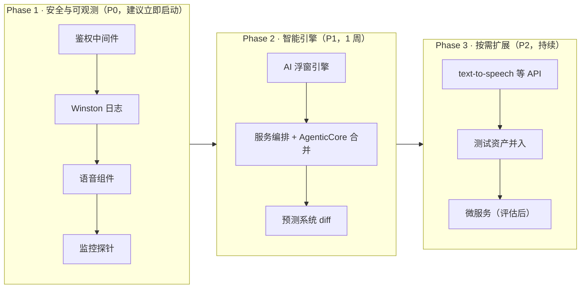

# 📊 兄弟项目对比分析与融合路线

> **分析对象**：`/Users/yanyu/YYC3-小语-AAA/YYC3-AI-Growth-Companion`
> **对比基线**：本仓库 `/Users/yanyu/YYC3-Baby`（统一基线，main 已推送）
> **方法**：基于底层代码逐模块审计（非文档推断），判定完成度后给出融合建议

## 一、结论速览

两个仓库为**同一家族的平行分化分支**，代码同源（App 路由、shadcn/ui、hooks、lib/ai 等约 70% 共享），但演进方向截然不同：

| 分支 | 定位 | 状态 |
| ---- | ---- | ---- |
| **YYC3-Baby（本项目）** | 收敛生产基线 | 类型债 0 · 测试 216 全绿 · CI/CD 全绿 · SQLite 真实持久化 |
| **YYC3-AI-Growth-Companion（目标项目）** | 功能探索超集 | 类型债 778 基线 · 大量引擎/后端/编排为真实现 · 微服务为骨架 |

**核心判断**：目标项目在 **AI 浮窗智能体系、服务编排、后端服务、日志监控、语音系统** 五个方向上是真实现（非空壳），值得移植；但其**微服务 6 个中 5 个为空目录**、类型债未清零、缺少真实化徽章/SQLite/文档中心。融合应以**本项目为基线**，目标项目为**移植源**。

## 二、全景对比矩阵

### 2.1 目标项目独有（可移植 → 本项目）

| 域 | 模块 | 规模 | 完成度 |
| ---- | ---- | ---- | ---- |
| AI 浮窗引擎 | `lib/mobility/MobilityEngine.ts` 移动性引擎 | 615 行 | ✅ 真实现 |
| AI 浮窗引擎 | `lib/continuity/ContinuityEngine.ts` 连续性引擎 | 743 行 | ✅ 真实现 |
| AI 浮窗引擎 | `lib/rules/RuleEngine.ts` + `EnhancedRuleEngine.ts` 自适应规则 | 916 + 1,644 行 | ✅ 真实现 |
| AI 浮窗引擎 | `lib/adaptability` / `lib/feedback` / `lib/learning` / `lib/optimization` | — | ✅ 真实现 |
| 服务编排 | `services/orchestrator/ServiceOrchestrator.ts` | 625 行 | ✅ 真实现 |
| 服务编排 | `services/gateway/APIGateway.ts`（路由/负载均衡/熔断/限流） | 874 行 | ✅ 真实现 |
| 服务编排 | `services/tools/`（ToolManager / ToolOrchestrator / ToolRegistry） | 1,751 行 | ✅ 真实现 |
| 服务编排 | `services/goals/GoalManagementSystem.ts` | 1,331 行 | ✅ 真实现 |
| 服务编排 | `services/learning/MetaLearningSystem.ts` | 971 行 | ✅ 真实现 |
| 服务编排 | `services/api/KnowledgeAPIService.ts` / `ToolAPIService.ts` | — | ✅ 真实现 |
| Express 后端 | `backend/src/`（index 213 + 3 controller 共 2,200 行） | 2,200 行 | ✅ 真实现 |
| 鉴权安全 | `backend/src/middleware/auth.ts`（JWT）+ `rateLimiter.ts`（redis） | — | ✅ 真实现 |
| 日志体系 | `lib/winston-logger.ts` / `lib/logger.client.ts` / `lib/log-analyzer.ts` + winston | — | ✅ 真实现 |
| 语音系统 | `lib/voice/voice-system.ts`（599 行）+ `components/voice/`（Recognition/Synthesis/Interaction） | 599+ 行 | ✅ 真实现 |
| 多模态 | `lib/multimodal_fusion.ts`（286 行）+ `app/api/ai/enhanced-emotion` | 286 行 | ✅ 真实现 |
| 预测增强 | `core/AgenticCore-Enhanced.ts`（DynamicModelSelector / QualityMonitor） | 1,659 行 | ✅ 真实现 |
| 监控 | `monitoring/grafana` + `prometheus.yml` + `prom-client` | — | ✅ 真实现 |
| 着陆页 | `site/index.html` + `CNAME`（xy.yyc3.vip）+ Pages 工作流 | — | ✅ 真实现 |
| API 增量 | `app/api/badges` / `app/api/metrics` / `app/api/ai/text-to-speech` | — | ✅ 真实现 |
| 页面增量 | `app/profile/page.tsx` | — | ✅ 真实现 |
| 测试增量 | badgeService / animation-system / i18n-core / model-provider / multimodal-fusion / pdf / speech / logger 等 20+ 测试文件 | — | ✅ 真实现 |
| 配置 | `bun.config.{coverage,performance,test}.ts` + `jest.config.js` 双测试运行时 | — | ✅ |
| Docker | `Dockerfile` + `docker-compose.{microservices,ollama,data-analytics,knowledge-graph}.yml` | — | ⚠️ 配置齐 |
| **微服务** | `microservices/` 6 个（ai/growth/knowledge/notification/recommendation/user） | 6 服务 | ❌ **骨架**（5 空 + user 1 文件） |

### 2.2 本项目独有（目标项目缺失 → 保持不变/反向输出）

| 域 | 模块 | 说明 |
| ---- | ---- | ---- |
| 徽章系统真实化 | `lib/badges/`（30 枚定义 + 真实数据评估引擎 + 17 测试 + `useBadges`） | 目标仅 1 个 badgeService 测试，无真实化引擎 |
| SQLite 持久化 | `lib/db/server.ts` + `sqlite-client.ts`（node:sqlite · WAL · 外键 · 种子） | 目标用 knex+pg，未接线到 App Router |
| 文档中心 | `docs/README.md` + `docs/developer/` 10 篇 + `docs/archive/` 归档 | 目标 docs/ 为 14 类规划文档，非开发文档套 |
| CI/CD 全绿 | `.github/workflows/ci.yml`（五道门禁）+ `deploy-pages.yml`（pandoc 文档站） | 目标 CI 以 build 为主、tsc 仅报告；Pages 为静态着陆页 |
| i18n 完整接线 | `i18n/`（routing/navigation/request）+ `middleware.ts` 混合路由 + `messages/{zh,en}` | 目标 `i18n/request.ts` + next-intl-stub |
| 品牌资产 | `public/YYC3-Family.png` + `role-photos/`（41 张角色图）+ `CNAME` | 目标无角色图库 |
| 前端增强组件 | `components/growth/enhanced/`（智能相册/时间线/里程碑/数据可视化）、`user-experience/`、`deployment/DeploymentManager`、`courses/AICourseRecommendation`、`ai-widget/IntelligentAIWidget` | 目标多数缺失 |
| AgenticCore | `core/AgenticCore.ts` 1,453 行 + `services/prediction/` | 目标 `core/AgenticCore.ts` 仅 3 行 stub |

### 2.3 共享基础（同源，无需融合）

- App 路由结构（app/ 与 app/[locale]/ 90% 相同）、components/ui（shadcn/Radix 全套）、25+ hooks 大部分相同
- `lib/ai/`、`lib/api/`、`lib/character-manager.ts`、`lib/asset-manager.ts`、`lib/multimodal_fusion.ts`、`lib/speech.ts`、`lib/pdf_generator.ts`、`lib/performance.ts`、`lib/resource-loader.ts`、`lib/growth_stages.ts`
- `types/`、`middleware.ts`、`next.config`、`components.json`

## 三、差距详析

### 3.1 目标项目对本项目的五个关键缺口

1. **无鉴权**：本项目所有 API 无 JWT 校验（README 已列"下一步：API 鉴权中间件"）；目标项目 `backend/src/middleware/auth.ts`（560 行 authController）为现成实现。
2. **无后端服务层**：本项目 App Router 路由直连 `lib/db/server.ts`，无独立 API 服务；目标项目 backend/（Express + rate-limiter-flexible + redis + multer + nodemailer + sharp + helmet）可整体移植。
3. **无日志体系**：本项目仅 `lib/logger.ts`（简单封装）；目标项目有 winston + 每日轮转 + 客户端日志 + 日志分析器。
4. **无监控**：本项目仅有 Vercel Analytics；目标项目 prom-client + Grafana + Prometheus 配置齐备。
5. **AI 浮窗非智能**：本项目 `components/ai-xiaoyu/FixedAIWidget.tsx` 为静态浮窗；目标项目配套 mobility/continuity/rules 引擎可实现"可移动、可自适、可持续"浮窗。

### 3.2 本项目对目标项目的三个优势

1. **质量门禁全绿**：本项目 tsc 0 错误、216 测试、CI/CD 可运行；目标项目 `typecheck-errors.txt` 标注 778 基线，tsc 仅作报告不阻塞。
2. **徽章/持久化已真实化**：本项目徽章基于真实行为数据评估并落 localStorage，SQLite 落盘；目标项目停留在设计/骨架。
3. **文档体系规范**：本项目 developer 文档套 + 文档中心 + Mermaid 架构图，符合"以代码为基"标准；目标项目文档为规划性质。

## 四、五维评估

| 维度 | 评估 |
| ---- | ---- |
| **时间** | 目标项目功能探索领先约 2-3 个迭代；本项目质量收敛领先 1 个迭代。合并后单分支可持续演进 |
| **空间** | 本项目模块边界清晰（app→hooks→lib→db）；目标项目多了一层 services/（编排）与 backend/（后端），需评估是否全部引入 |
| **属性** | 本项目：可维护性高（文档+门禁）；目标项目：功能丰富但可维护性弱（778 类型债）。融合需保持本项目门禁 |
| **事件** | 目标项目事件驱动体系更强（EventEmitter 贯穿引擎/编排/规则）；本项目事件处理集中于 hooks |
| **关联** | 目标项目微服务/编排层依赖 Docker/多进程部署，与本项目单机 Node 部署形态冲突 —— 微服务暂缓 |

## 五、可融合并行项（按优先级）

### P0 —— 高价值 · 低风险 · 可立即并行

| # | 融合项 | 目标源码 | 落地到本项目 | 收益 | 状态 |
| ---- | ---- | ---- | ---- | ---- | ---- |
| 1 | **API 鉴权中间件** | `backend/src/middleware/auth.ts`、`controllers/authController.ts`、`middleware/rateLimiter.ts` | `lib/auth/`（jwt/guard/service/mapper）+ `app/api/auth/*`（register/login/refresh/logout/profile）+ 写路由保护 | 补齐 README 规划的"API 鉴权中间件"，安全闭环 | ✅ 已完成 2026-08-19 |
| 2 | **Winston 日志体系** | `lib/winston-logger.ts`、`lib/logger.client.ts`、`lib/log-analyzer.ts` | `lib/logger/`（server/analyzer/index）+ 接入 auth 端点与 error-report | 可观测性提升，替代现有 console.error | ✅ 已完成 2026-08-19 |
| 3 | **语音组件补齐** | `components/voice/VoiceRecognition.tsx`、`VoiceSynthesis.tsx`、`lib/voice/voice-system.ts` | 与本项目 `lib/voice/`、`components/voice/VoiceInteraction.tsx` diff 合并 | 语音交互闭环 |
| 4 | **监控探针** | `lib/monitoring/`、`monitoring/prometheus.yml`、prom-client | 移植 `lib/monitoring/`（后端探针），Grafana 配置可后续接 | 生产可观测性 |

### P1 —— 高价值 · 需架构决策

| # | 融合项 | 目标源码 | 落地方式 | 注意事项 |
| ---- | ---- | ---- | ---- | ---- |
| 5 | **AI 浮窗智能引擎** | `lib/mobility/`、`lib/continuity/`、`lib/rules/`、`lib/adaptability/`、`lib/feedback/` | 以本项目 `FixedAIWidget` + `IntelligentAIWidget` 为宿主，接入移动/连续/规则引擎 | 引擎为 EventEmitter 事件模型，需确认 React 集成方式 |
| 6 | **服务编排层** | `services/orchestrator/`、`services/gateway/`、`services/tools/`、`services/goals/`、`services/learning/` | 与本项目 `core/AgenticCore.ts`（1,453 行）合并，产出增强版 AgenticCore | 两版 AgenticCore 均为真实现，需逐模块比对去重 |
| 7 | **预测系统增强** | `AgenticCore-Enhanced.ts`、`services/prediction/model-selector.ts`、`quality-monitor.ts` | 与本项目 `services/prediction/` diff 合并 | 本项目已有 base-predictor 富基类 |
| 8 | **Express 后端扩展** | `backend/src/controllers/{ai,growth}Controller.ts` | 评估是否需要独立后端（当前 App Router 直连 db 可满足）；如需多进程/独立服务则引入 | 部署形态决策前置 |

### P2 —— 低优先级 / 骨架暂缓

| # | 融合项 | 说明 |
| ---- | ---- | ---- |
| 9 | **微服务 microservices/** | 6 个服务 5 个为空，暂不融合；等单体功能验证后按需落地 |
| 10 | **着陆页 site/** | 本项目已有 pandoc 文档站，可参考其 `CNAME` + 资源复制思路优化 deploy-pages |
| 11 | **API 增量路由** | `app/api/badges`、`app/api/metrics`、`app/api/ai/text-to-speech`、`app/profile` —— 按需移植（text-to-speech 收益较高） |
| 12 | **测试资产** | 目标项目 20+ 测试文件（animation/i18n-core/model-provider/speech 等）可并入 `__tests__/`，复用其 bun.config 多档配置思路 |

## 六、融合路线图

**执行原则**：

1. **以本项目为基线**，目标项目仅作移植源 —— 保持类型债 0、248 测试全绿、CI/CD 门禁
2. 每个 P0 项独立成 commit，先移植源码 + 补测试 + 跑门禁，再进下一个
3. 每项融合后更新 [docs/developer/](../developer/) 对应篇目与 [docs/status/project-status.md](../status/project-status.md)
4. 合并前用 `git diff --no-index` 对共享文件（multimodal_fusion、AgenticCore、lib/ai/*）做差异比对，避免覆盖本项目已有增强

## 七、风险与注意事项

| 风险 | 等级 | 缓解 |
| ---- | ---- | ---- |
| 目标项目类型债 778，直接移植可能引入 tsc 错误 | 🔴 高 | 每项移植后立即 `bunx tsc --noEmit`，不达标不进下一个 |
| 两版 AgenticCore / multimodal_fusion 均为真实现，盲目覆盖会丢增强 | 🔴 高 | 先 `git diff --no-index` 逐模块比对，再决定合并策略 |
| 配置体系差异：目标 `next.config.ts`/`tailwind.config.cjs` vs 本项目 `next.config.mjs` | 🟡 中 | 只移植源码模块，配置以本项目为准 |
| 新依赖（hono/winston/prom-client/zustand/@tensorflow/tfjs-converter）增大体积 | 🟡 中 | 按需引入；winston/prom-client 仅服务端引入 |
| 微服务/Docker 编排与单机部署形态冲突 | 🟢 低 | P2 暂缓，评估后再定 |

---

**分析结论**：目标项目是宝贵的"功能富矿"，本项目是"生产基线"。建议按 **P0 → P1 → P2** 分三阶段并行融合，始终以本项目质量门禁为准绳，确保每一步都可交付、可回滚、可追溯。

**下次打开起点**：从 P0-1「API 鉴权中间件」开始，移植 `backend/src/middleware/auth.ts` → 接本项目 API 路由 → 补测试 → 跑门禁。
