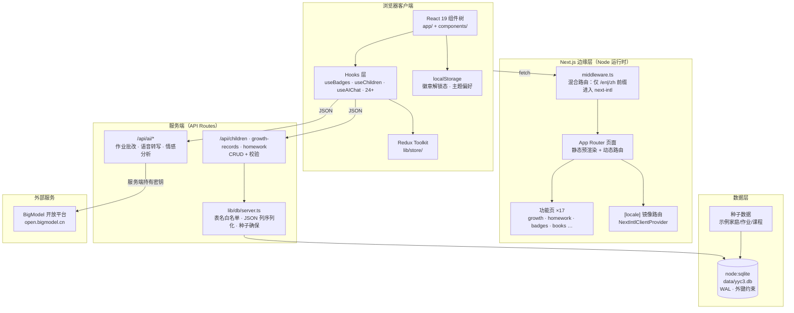
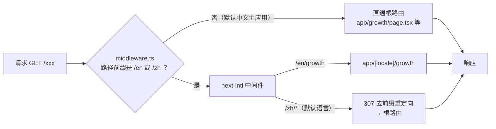
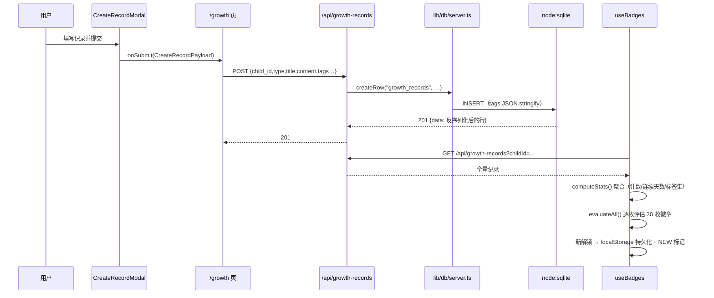
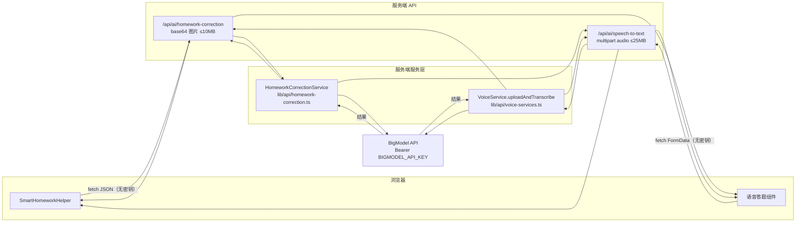
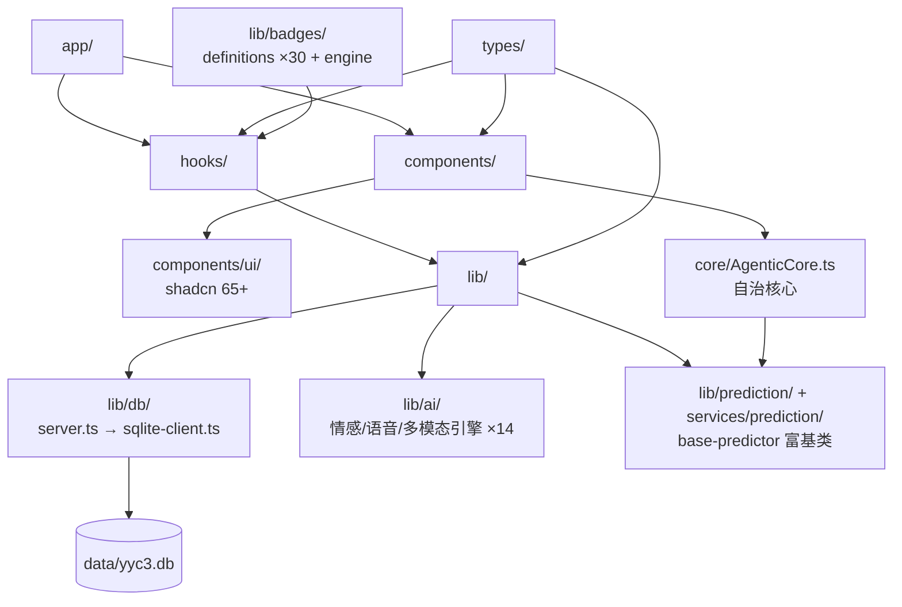
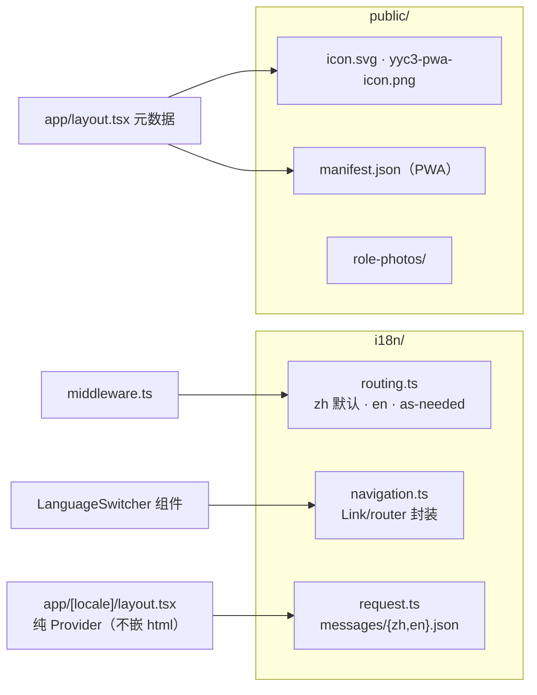

# 02 · 可视化架构体系

> 全部图表为 Mermaid，可在 GitHub / VS Code（Mermaid 插件）直接渲染。

## 1. 系统分层总览

**关键约束：** AI 密钥只存在于服务端（`BIGMODEL_API_KEY`），浏览器永不接触 —— 所有 AI 调用必须走 `/api/ai/*` 代理。

## 2. 混合路由请求流（middleware）

> 历史教训：若让 next-intl 处理全部根路由，会把整个中文主应用重写进 `[locale]` 世界导致全站 404。此为当前架构的核心防御点。

## 3. 数据写入与徽章评估流

## 4. AI 代理链路（安全边界）

## 5. 目录拓扑（核心模块依赖方向）

依赖铁律：`app → components/hooks → lib → 数据与外部服务`，禁止反向依赖；`types/` 为全局叶子。

## 6. 国际化与静态资产

## 7. 部署形态

```mermaid
flowchart LR
    subgraph Dev["开发"]
        D1["bun run dev<br/>next dev :1228"]
    end
    subgraph Prod["生产（Node 进程）"]
        B1["bun run build<br/>Turbopack + 全类型检查"] --> S1["next start :1228"]
        S1 --> FS[("data/yyc3.db<br/>进程外持久化文件")]
    end
    subgraph Alt["备选"]
        DOC["scripts/deploy-docker.sh"]
        BAK["VACUUM INTO 备份"]
    end
```

> ⚠️ 服务进程必须跑 Node（`node:sqlite` 需要 Node ≥ 22.13）。`bun --bun next start` 与 Next 16 Turbopack 产物不兼容，仅用 Bun 跑测试。
