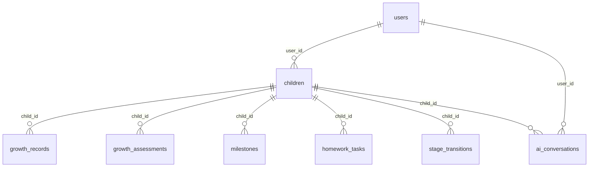

# 03 · 数据模型

> 存储：`node:sqlite`（文件级 SQLite，WAL 模式，外键约束开启），库文件 `data/yyc3.db`（已 gitignore）。
> 定义源码：`lib/db/sqlite-client.ts`（建表 SQL）与 `lib/db/schema.ts`。

## 实体关系



## 九张表

| 表 | 用途 | 关键列 | JSON 列（自动序列化） |
|----|------|--------|----------------------|
| `users` | 家长账户 | email(唯一)、role、password_hash、first_name/last_name、is_active、email_verified（JWT 鉴权，P0-1 融合） | — |
| `children` | 宝宝档案 | birth_date、gender、current_stage | — |
| `growth_records` | 成长记录 | type(milestone/observation/emotion/learning)、recorded_at | media_urls、tags |
| `growth_assessments` | 成长评估 | overall_score、stage_id | dimensions、recommendations |
| `milestones` | 里程碑 | milestone_type、achieved_at | celebration_data |
| `ai_conversations` | AI 对话存档 | session_id | messages |
| `homework_tasks` | 作业任务 | status(pending/in_progress/completed/overdue)、priority | — |
| `courses` | 课程 | subject、difficulty_level(1-5) | content、media_urls、tags |
| `stage_transitions` | 成长阶段变迁 | from_stage→to_stage | — |

索引已覆盖全部外键列与高频查询列（recorded_at / due_date / status 等）。

## JSON 列约定（重要）

数据库内 JSON 列以**字符串**存储；`lib/db/server.ts` 提供双向透明转换：

- 写入（`createRow/updateRow`）：数组/对象自动 `JSON.stringify`
- 读取（`listRows/getRow`）：自动 `JSON.parse`，坏值容错为 `[]`
- **API 层永远只见结构化数据，不见 JSON 字符串**

## 服务端访问层

```ts
// app/api/*/route.ts 中唯一推荐用法
import { listRows, createRow, getRow, updateRow, deleteRow, isForeignKeyError } from "@/lib/db/server"

const rows = await listRows("growth_records", { child_id: id }) // 表名白名单校验
const created = await createRow("children", { ... })            // 自动补 id/created_at
```

禁止在路由中直接拼 SQL 或引用 `sqlite-client` 的原始方法（绕过白名单与序列化）。

## 种子数据

首次访问任意数据接口时自动执行 `seedMockData()`（幂等：已有 users 数据则跳过）：
示例用户「张女士」→ 宝宝「小语」→ 1 条里程碑记录 + 2 个作业任务 + 2 门课程。

重置：删除 `data/yyc3.db*` 后重启。

## 备份

```ts
getDatabase().backup("./backups/snapshot.db")   // VACUUM INTO，在线安全备份
```

未来扩展（路线图）：PostgreSQL 适配层位于 `lib/db/client.ts` 接口抽象之后，替换 `SQLiteDatabase` 实现即可。
