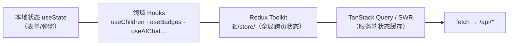

# 05 · 前端组件体系

## 目录组织（components/ 20 个域目录）

| 目录 | 职责 |
|------|------|
| `ui/` | shadcn/ui 基础件 65+（Button/Card/Dialog/Form/Tabs…），Radix 无障碍基座 |
| `ui/character-themed/` | 角色主题组件族（Input/Container/Alert），消费 `components/CharacterThemeContext` |
| `headers/` `common/` | 页面头（PageHeader）、通用件（LanguageSwitcher 等） |
| `growth/` | 成长域：仪表盘、时间线、图表、里程碑庆祝、智能相册 |
| `homework/` | 作业域：SmartHomeworkHelper（拍照批改+语音答题） |
| `emotion/` | EmotionMonitor 情绪监测面板 |
| `analytics/` | 指标总览、实时活动流、WebSocket 连接 |
| `prediction/` | 预测仪表盘、实时监控、智能配置面板 |
| `ai-xiaoyu/` `ai-widget/` | AI 小语浮窗（FixedAIWidget）与可拖拽智能浮窗（AgenticCore 驱动） |
| `auth/` | LoginModal、UserCenter |
| `accessibility/` `pwa/` | 无障碍面板、PWA 提示 |
| `theme/` | 生日主题族（Countdown/WishForm/Decorations） |
| `books/` `courses/` | 绘本与课程域 |
| `optimization/` `performance/` `deployment/` `testing/` | 懒加载封装、性能面板、部署向导、系统测试套件 |

## 状态管理分层



选型规则：**能 useState 不上 Hook，能 Hook 不上 Redux，服务端数据一律走 fetch + 缓存库**。

## 徽章系统（本次完善后的标准范式）

新功能推荐参照徽章系统的四层结构：

```
types/badges.ts          类型（数据形状与展示元数据）
lib/badges/definitions   领域定义（30 枚勋章 = 纯数据 + 纯函数）
lib/badges/engine.ts     评估引擎（computeStats / evaluateAll 纯函数，100% 可单测）
hooks/useBadges.ts       数据接入（fetch 聚合 + localStorage 持久化 + 新解锁通知）
app/badges/page.tsx      纯展示（筛选/网格/详情弹窗/分享）
__tests__/lib/badges.test.ts  17 个用例锁行为
```

要点：定义与引擎零副作用、页面零业务逻辑、解锁状态跨会话持久化（`yyc3_badge_unlocks_v1`）。

## 主题与角色系统

- `components/CharacterThemeContext`（reducer 型）提供 currentCharacter / themeColors / 表情切换 Hooks
- `themes/` 存三套 Figma 主题参考（cyberpunk/default/liquid）——**未接线**，接线时需补齐其内部相对导入（`../foundation/*` 等），已排除出 tsc
- 全局 Tailwind 4（`app/globals.css`），无暗色模式切换时使用 `next-themes` 可直接挂接

## 动画

framer-motion 12：页面级 `AnimatePresence` 过渡、卡片 `whileHover` 微交互、徽章解锁 `animate-pulse` NEW 标记。列表动画 delay 按 `index * 0.03s` 封顶防长列表卡顿。
