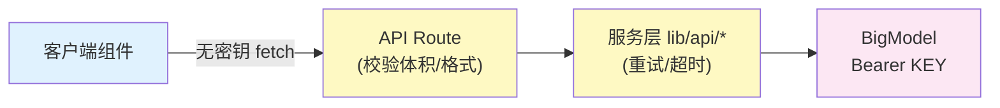

# 06 · AI 引擎与安全

## 密钥管理铁律

1. 密钥只放服务端变量 `BIGMODEL_API_KEY`（`.env.local`，已 gitignore）
2. **永远不要**加 `NEXT_PUBLIC_` 前缀——该前缀会把值打进浏览器包
3. 浏览器组件只 fetch `/api/ai/*`，不 import 任何 `lib/api/*` 服务模块
4. `.env.example` 提供全部变量样板，不含真实值
5. 密钥泄露（进过 git 历史）的唯一处置：控制台轮换 + 删历史备份

## 服务端代理模式

新增 AI 能力的三步：`lib/api/xxx.ts`（服务封装）→ `app/api/ai/xxx/route.ts`（校验+代理）→ 客户端 fetch。

## lib/ai/ 引擎模块清单（15 个）

| 模块 | 职责 | 接线状态 |
|------|------|---------|
| emotion-engine | 0-3 岁情感识别（InfantEmotionType 枚举 + TensorFlow.js 嵌入） | ✅ |
| emotion-monitor / emotion-adapter / enhanced-emotion-fusion | 情绪监测/适配/多模态融合 | ✅ |
| enhanced-voice-services / voice-interaction | 语音合成/识别/情绪化参数 | ✅ |
| xiaoyu-ai-mentor-system | 小语导师人设 | ✅ |
| xiaoyu-multimodal-core / xiaoyu-philosophy-core | 多模态核心/教育哲学 | ✅ |
| modular-ai-system | 可插拔 AI 模块管理器 | ✅ |
| autonomous-engine / role-coordinator | 自治引擎/角色协调 | ✅ |
| intelligent-feedback-system | 智能反馈 | ✅ |
| performance-optimizer | AI 响应加速（缓存/批处理） | ✅ |

> 历史上有 3 个引用幻影 API 的半成品引擎（zhishu-ai-core 等）已删除，git 历史可找回。

## AgenticCore（core/AgenticCore.ts）

事件驱动 + 目标驱动的自治核心：任务分解（子任务 DAG）→ 数据预处理 → 模型选择 → 集成预测 → 评估 → 优化闭环。
由 `components/ai-widget/IntelligentAIWidget` 实例化（客户端运行，不直接触网），依赖 `services/prediction/` 的模型选择与质量监控。

## 安全响应头

`next.config.mjs` 为全部路由注入：`X-Content-Type-Options: nosniff`、`X-Frame-Options: SAMEORIGIN`、`Referrer-Policy`、`Permissions-Policy`（camera/geolocation 关闭，麦克风仅自源）。

## 密钥轮换流程（本次实操存档）

1. BigModel 控制台 → API Keys → 新建
2. 更新 `.env.local` 的 `BIGMODEL_API_KEY`
3. 验证：`curl https://open.bigmodel.cn/api/paas/v4/chat/completions -H "Authorization: Bearer $KEY" -d '{"model":"glm-4-flash","messages":[{"role":"user","content":"OK"}]}'`
4. 删除旧密钥的一切本地备份
