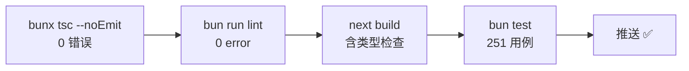

# 07 · 测试与质量门禁

## 四道门禁（提交前应全绿）



| 门禁 | 命令 | 当前基线 |
| ------ | ------ | --------- |
| 类型 | `bun run type-check` | **0 错误**（应用代码；`__tests__/`、`themes/` 排除） |
| Lint | `bun run lint` | **0 error**，~460 warning（见债务清单） |
| 构建 | `bun run build` | 通过（类型门禁已恢复，无 ignoreBuildErrors） |
| 测试 | `bun test` | 251/251（19 文件，<1s；含 38 个安全行为用例） |
| 依赖 | `npm audit --package-lock-only --registry=https://registry.npmjs.org` | 0 漏洞 |

## 测试套件结构

```
__tests__/
├── lib/badges.test.ts      17 用例：统计聚合/评估引擎/持久化幂等/定义完整性
├── lib/auth.test.ts        9 用例：JWT 签发/过期/伪造/行映射（P0-1）
├── lib/logger.test.ts      10 用例：日志解析/统计/告警/目录扫描（P0-2）
├── lib/theme-system.test.ts 13 用例：四主题注册/明暗映射/背景层/CSS 完整性/语义类（Phase 2-3）
├── lib/utils/formatDate*   中英日期/相对时间（昨天·前天）/周岁计算
├── hooks/                  useAIChat · useGrowthRecords · useAccessibility…
├── components/             ProfilePage · LanguageSwitcher…
└── pages/                  settings
```

运行时：Bun test + jsdom（`bun.test.preload.ts` 提供 DOM 环境与 framer-motion mock）。

**测试写法范式**（以徽章引擎为例）：纯函数 → 直接断言；Hook → bun:test + renderHook 风格；组件 → jsdom 渲染 + 行为断言。中文用例名与产品语言一致。

## Lint 债务清单（warning 级，按域消化）

| 规则族 | 存量 | 说明 |
| -------- | ------ | ------ |
| no-explicit-any / no-unsafe-* | ~300 | 历史 any，按目录改 typed |
| require-await | ~120 | 同步实现的 async 接口（既有 API 契约，改动需评估调用方） |
| no-floating-promises | ~116 | UI 事件 fire-and-forget，补 `void`/`.catch` |
| React Compiler（immutability/purity/refs/static-components） | ~90 | React 19 编译器兼容整改 |
| no-confusing-void-expression | ~100 | 风格，`lint:fix` 可清 |

每清一个规则族 → 在 `eslint.config.js` 把它升回 `error`，防止回潮。

## 类型债治理史（存档）

1,986（合并初期）→ 990（tsconfig 标准化）→ 804（themes 排除+补类型族）→ 415（完整化阶段）→ **0**（清零冲刺，2026-08-19）。当前维持 0 错误基线（`bunx tsc --noEmit` 全量校验）。
